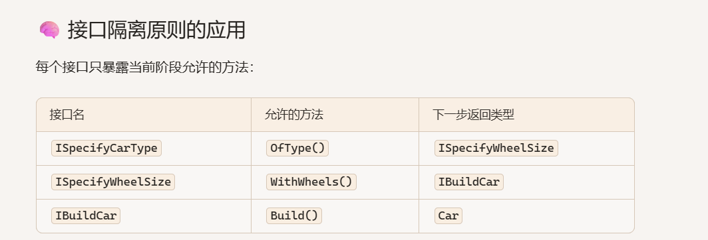
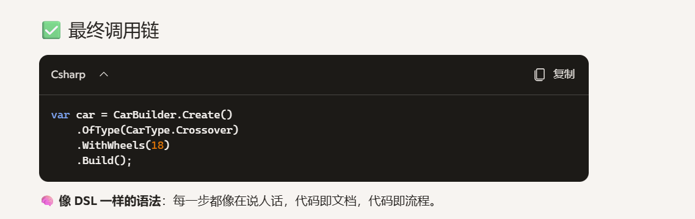

这段代码是 Step Builder Pattern 的典范实现，专门解决“构建对象时必须按顺序执行步骤”的问题。我们来用生动的方式逐步讲解其中的语法和设计思路，就像你在流水线上组装一辆车，每一步都必须精准对接。

## 🚗 整体类比：像汽车装配线一样的构建流程

你不能先装轮子再决定车型，也不能跳过轮子直接开车。Step Builder 就是把构建过程变成这种“强约束的装配线”，每一步都返回下一步的“合法工具”。

### 🧩 分步讲解语法与设计
1. CarBuilder.Create() 返回 ISpecifyCarType
```csharp
public static ISpecifyCarType Create()
{
    return new Impl();
}
```

🔍 意思：构建流程从“指定车型”开始，返回的是 ISpecifyCarType 接口。

🧠 类比：就像你走进 4S 店，销售员只让你先选车型，其他选项暂时隐藏。

### 2. OfType(CarType.Crossover) 返回 ISpecifyWheelSize

```csharp
public ISpecifyWheelSize OfType(CarType type)
{
    car.Type = type;
    return this;
}
```
🔍 意思：你选了车型，系统记录下来，并把你引导到“选轮子大小”的阶段。

🧠 类比：你说“我要 SUV”，销售员说“那轮子必须在 17 到 20 寸之间”。

📌 返回类型是接口：这一步只暴露 WithWheels() 方法，其他方法不可见。

### 3. WithWheels(18) 返回 IBuildCar

```csharp
public IBuildCar WithWheels(int size)
{
    switch (car.Type)
    {
        case CarType.Crossover when size < 17 || size > 20:
        case CarType.Sedan when size < 15 || size > 17:
            throw new ArgumentException($"Wrong size of wheel for {car.Type}");
    }

    car.WheelSize = size;
    return this;
}
```
🔍 意思：你选了轮子大小，系统验证是否符合车型要求，然后进入“最终构建”阶段。

🧠 类比：你说“我要 18 寸轮子”，系统检查是否合规，不合规就拒绝你。

📌 类型安全 + 业务校验：轮子大小与车型绑定，编译期约束 + 运行期验证双保险。


### 4. Build() 返回最终对象

```csharp
public Car Build()
{
    return car;
}
```

🔍 意思：你完成所有步骤，系统把车交付给你。

🧠 类比：你签字确认，销售员把钥匙递给你。



📌 好处：

强制顺序：不能跳步骤

编译期约束：漏掉某步就编译失败

可读性强：每一步都像 DSL（领域特定语言）



## Impl作用

🎯 它的职责：
实现所有构建步骤对应的接口方法

存储构建中的数据（通过 private Car car = new Car()）

控制构建流程的合法性（如轮子大小校验）

最终生成目标对象（通过 Build() 方法）

🧠 类比理解：Impl 就像“汽车装配机器人”
你看到的 CarBuilder.Create() 是用户入口，像是按下“开始造车”的按钮。 而 Impl 是在后台工作的机器人，负责：

接收你的车型选择

校验轮子尺寸是否匹配

把所有零件组装成一辆合法的车

🔍 为什么用私有类 Impl 而不是公开类？
封装性：用户只接触接口，不暴露内部实现细节

安全性：防止用户绕过步骤或直接访问构建数据

可维护性：你可以随时修改 Impl 的实现，不影响外部调用者

✅ 构建流程入口：Create()

```csharp
public static ISpecifyCarType Create()
{
    return new Impl();
}
```
用户调用 Create()，拿到的是 ISpecifyCarType 接口

实际返回的是 Impl 的实例，但只暴露第一步接口

随着每一步调用，Impl 逐步“解锁”下一个接口

🔁 每一步怎么返回自己？

```csharp
public ISpecifyWheelSize OfType(CarType type)
{
    car.Type = type;
    return this;
}
```
this 是 Impl 的实例

因为 Impl 实现了所有接口，所以可以在每一步返回自己

每个接口只暴露当前阶段的方法，形成“逐步引导”的效果
