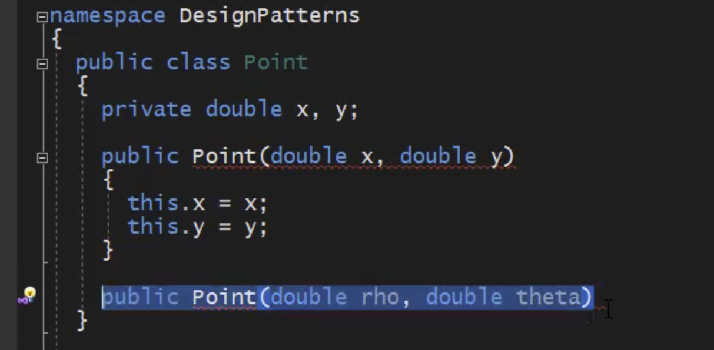
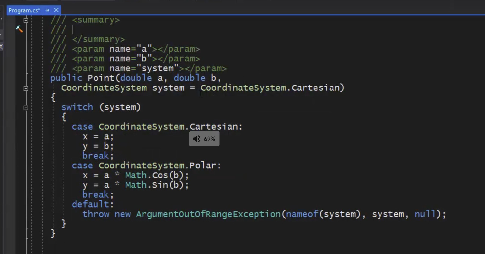

* Object creation logic becomes too convoluted
* Constructor is not descriptive
  *  Name mandated by name of containing type
  * Cannot overload with same sets of arguments with different names
  * Can turn into 'optional parameter hell'
* Object creation (non-piecewise, unlike Builder) can be outsourced to 
    * A separate function(Factory Method)
    * That may exist in a separate class(Factory)
    * Can create hierachy of factories with Abstract Factory 

## Factory
A  component responsible solely for the wholesale (not piecewise) creation of objects.

### 构造函数当类型相同时无法重构

修改办法：

